# VMware Cloud Foundation (VCF) 9.1.1 in a Box

Deploy a fully functional VMware Cloud Foundation 9.1.1 environment on one, two or three physical ESX hosts, optimized for development and lab use. This setup enables users to explore the full capabilities of VCF 9.1.1, ranging from Fleet Management, Self-Service Automation with Multi-Tenancy to running modern container and AI workloads, all while using minimal compute and storage resources.

📒 This deployment does not use Nested ESX and instead runs directly on physical hosts, in contrast to the [VCF Holodeck](https://vmware.github.io/Holodeck/) solution.

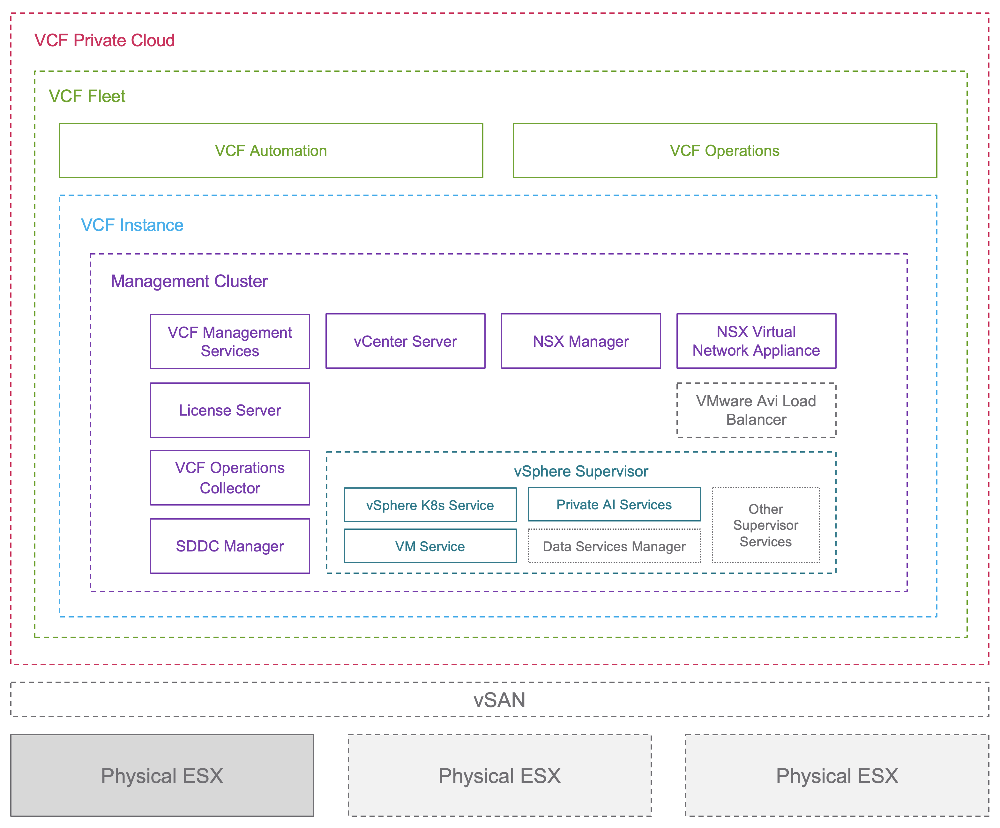

## Table of Contents

* [Changelog](#changelog)
* [Bill of Materials (BOM)](#bill-of-materials-bom)
* [Prerequisites](#prerequisites)
* [Installation](#installation)
* [Post Installation](#post-installation)
* [Additional Blog Resources](#additional-blog-resources)

## Changelog

* **10/23/2026**
  * Updated for VCF 9.1.1

* **05/28/2026**
  * Initial Release

## Bill of Materials (BOM)

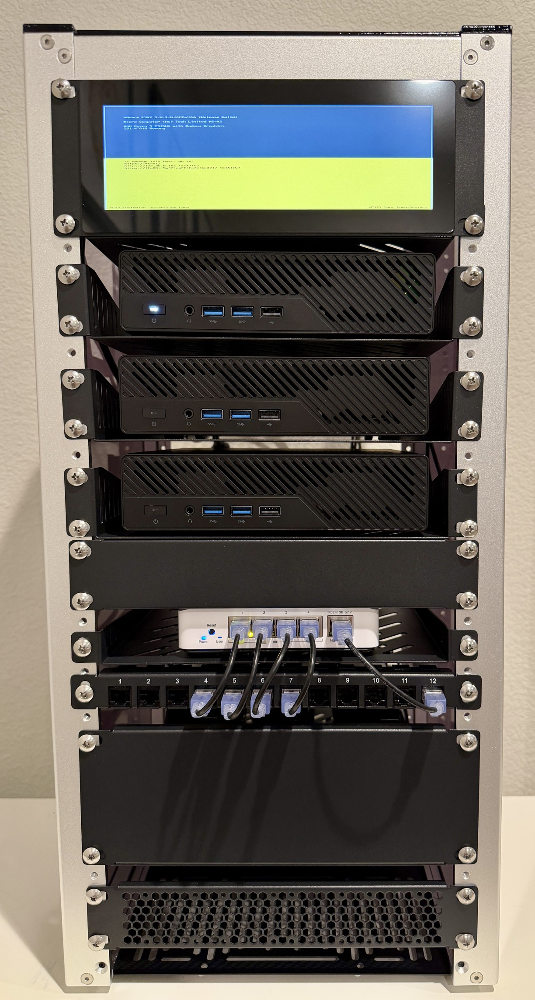

| Category | Component | Function / Details | Qty | Unit Price (USD) |
| :--- | :--- | :--- | :---: | :---: |
| Server | [Minisforum MS-A2 (7945HX) Barebones](amzn.to/46xuK3X) | ESX Host | 2-3 | $789.00 |
| Server | [Crucial 128GB Kit (2x64GB) DDR5 SODIMM](amzn.to/4bcpXFJ) | ESX Memory | 2-3 | $279.99 USD ($1195 USD as of 01/07/26) |
| Server | [SK Hynix Gold P31 500GB NVME](amzn.to/4eKEQkm) | ESX Install + VMFS Volume | 2-3 | $44.09 USD |
| Server | [Samsung SSD 990 PRO 1TB NVME](https://amzn.to/4rp0uku) | vSAN ESA | 2-3 | $399 |
| Server | [Samsung 980 PRO 1TB NVME](https://amzn.to/4hcoDGc) | NVMe Tierinng | 2-3 | Owned Previously |
| Networking | [MikroTik CRS304-4XG-IN](amzn.to/44J1rt4) | 10GbE Routing Switch | 1 | $188.00 |
| Networking | [Sodola 5 x 10GbE Managed Switch](amzn.to/3PD5eUY) | 10GbE Managed Switch | 1 | $169.00 |
| Networking | [10Gtek SFP+ to RJ45 Module](https://amzn.to/4nAs6B9) | SFP+ to RJ45 Adapter for MS-A2 | 2-3 | $70.75 |
| Private AI | [RTX 4000 SFF Ada with 20GB VRAM](https://amzn.to/4mSxQ7J) | GPU for Private AI Services | 1 | $1,199 |
| Private AI | [Aoostar AG01 OCuLink eGPU Dock](https://aoostar.com/products/aoostar-ag01-egpu-dock-with-oculink-port-built-in-huntkey-800w-power-supply-pre-order-itll-be-shipped-around-february-20th) | eGPU Dock | 1 | $179 |
| Rack Enclosure | [DeskPi RackMate T2 (12U)](https://amzn.to/4mZmlvd) | Mini-Rack Chassis (12U) | 1 | $159.99 |
| Rack Accessory | [DeskPi 7.84 inch LCD Touch Screen](https://amzn.to/3KCZ0C4) | 2U Direct Console Display | 1 | $89.99 |
| Rack Accessory | [DeskPi Server 2-Pack Rack Shelf](https://amzn.to/46SFjgU) | 0.5U Mounting Shelf | 1 | $32.39 |
| Rack Accessory | [DeskPi Server Rack Shelf](https://amzn.to/3KD7Orz) | 1U Mounting Shelf | 2 | $25.99 |
| Rack Accessory | [DeskPi Server Rack Blank Panel](https://amzn.to/4nL5xsV) | 2U Blank Panel | 1 | $14.99 |
| Rack Accessory | [DeskPi 12-port Patch Panel](https://amzn.to/42vwfNP) | 0.5U Ethernet Patch Panel | 1 | $18.39 |
| Rack Accessory | [DeskPi 12-Port Blank Patch Panel](https://amzn.to/48jOAB9) | 0.5U Blank Patch Panel | 1 | $10.39 |
| Rack Accessory | [Blazin3D 12-port PDU](https://amzn.to/4n4EUhG) | 1U Power Distribution Unit | 1 | $49.99 |
| Rack Accessory | [1.5 Inch EMA 5-15P Extension Power Cord](https://amzn.to/4gZg413) | Power Cables | 3 | $6.99 |
| Rack Accessory | [Dual 120MM USB Fan]((https://amzn.to/3W03iFV)) | Rack Enclosure Cooling | 1 | $21.99 |
| Rack Accessory | [Monoprice SlimRun 5-pack 2 feet Cat6 Cable](https://amzn.to/3IYcCXT) | Patch Cabling | 1 | $9.02 |
| Rack Accessory | [Monoprice SlimRun 5-pack 6 inch Cat6 Cable](https://amzn.to/4gZS6CV) | Short Patch Cabling | 1 | $9.02 |
| Rack Accessory | [D-Ring Cable Management Hooks](https://amzn.to/4o3Etpb) | 5-Pack Routing Hooks | 1 | $13.79 |
| Rack Accessory | [18" Zip Ties](https://amzn.to/4q55Y2T) | 100-Pack Cable Ties | 1 | $9.99 |

📒 The above BOM is just an example. You can certainly swap out full systems and/or components that you might already have or prefer alternatives. Just know that you are responsible for adjusting any configuration that may differ from the referenced BOM.

## Prerequisites

* Minimum 5 VLANs (e.g. 30, 40, 50, 60, 70) for VCF Fleet Deployment
    * VLAN 30 - Management
    * VLAN 40 - vMotion
    * VLAN 50 - vSAN
    * VLAN 60 - ESX/NSX Edge TEP
      * Can be used for VLAN-backed VPC (Optional)
    * VLAN 70
       * Tier 0 Uplink for Centralized Transit Gateway (Optional)
       * External Connectivity for Distributed Transit Gateway (Optional)

* Here are the IP addresses and DNS entries that you will need for initial setup (NSX Edge/VNA and vSphere Supervisor are optional)

| Hostname   | FQDN                | IP Address              | Function                                     |
|------------|---------------------|-------------------------|----------------------------------------------|
| esx01      | esx01.vcf.lab       | 172.30.0.10             | Physical ESX-1 Server                        |
| esx02      | esx02.vcf.lab       | 172.30.0.11             | Physical ESX-2 Server                        |
| esx03      | esx03.vcf.lab       | 172.30.0.12             | Physical ESX-3 Server                        |
| sddcm01    | sddcm01.vcf.lab     | 172.30.0.18             | VCF Installer / SDDC Manager                 |
| vc01       | vc01.vcf.lab        | 172.30.0.19             | vCenter Server for Management Domain         |
| vcf01      | vcf01.vcf.lab       | 172.30.0.20             | VCF Operations                               |
| vcf-msr01  | vcf-msr01.vcf.lab   | 172.30.0.21             | VCF Management Services Runtime              |
| vcf-flt01  | vcf-flt01.vcf.lab   | 172.30.0.22             | VCF Fleet Components FQDN                    |
| vcf-int01  | vcf-int01.vcf.lab   | 172.30.0.23             | VCF Instance Components FQDN                 |
| vcf-lic01  | vcf-lic01.vcf.lab   | 172.30.0.24             | VCF License Server                           |
| vcf-log01  | vcf-log01.vcf.lab   | 172.30.0.26             | VCF Operations for Logs (Optional)           |
| vcf-idb01  | vcf-idb01.vcf.lab   | 172.30.0.27             | VCF Identity Broker                          |
|            | 172.30.0.32/28      | 172.30.0.33-172.30.0.46 | VCF Management Services Runtime Node IP Pool |
| nsx01      | nsx01.vcf.lab       | 172.30.0.48             | NSX Manager VIP for Management Domain        |
| nsx01a     | nsx01a.vcf.lab      | 172.30.0.49             | NSX Manager for Management Domain            |
| edge01a    | edge01a.vcf.lab     | 172.30.0.50             | NSX Edge 1a for Management Domain (Optional) |
| edge01b    | edge01b.vcf.lab     | 172.30.0.51             | NSX Edge 1b for Management Domain (Optional) |
| vna01a     | vna01a.vcf.lab      | 172.30.0.52             | NSX VNA 1a for Management Domain             |
| vna01b     | vna01b.vcf.lab      | 172.30.0.53             | NSX VNA 1b for Management Domain (Optional)  |
|            |                     | 172.30.0.54             | NSX Edge VIP (Optional)                      |
| vcf-proxy01| vcf-proxy01.vcf.lab | 172.30.0.55             | VCF Operations Proxy Collector               |
| vcf-asr01  | vcf-asr01.vcf.lab   | 172.30.0.56             | VCF Automation Services Runtime              |
| auto01     | auto01.vcf.lab      | 172.30.0.57             | VCF Automation                               |
|            | 172.30.0.64/29      | 172.30.0.65-172.30.0.70 | VCF Automation Services Runtime Node IP Pool |
| sv01       | sv01.vcf.lab        | 172.30.0.80-172.30.0.85 | vSphere Supervisor Node IP Pool              |

📒 For Distributed Transit Gateway (DTGW) configuration, we can optimize the VLAN 70 network and carve it up into smaller /26 networks rather than consuming an entire block when enabling vSphere Supervisor
* 172.30.70.0/26
* 172.30.70.64/26
* 172.30.70.128/26
* 172.30.70.192/26

## Installation

0. Update your hardware to the latest vendor firmware
    * For MS-A2 owners, please follow [these instructions](https://williamlam.com/2025/07/quick-tip-updating-firmware-on-minisforum-ms-a2.html) for firmware
    * Apply these [these instructions](https://williamlam.com/2026/03/maximizing-vsan-esa-performance-on-minisforum-ms-a2.html) for network optimizations if you are doing a manual installation (already incorporated into ESX kickstart examples)

1. Set up a VCF Offline Depot using the new `VCF Download Tool` by following the [Broadcom documentation](https://techdocs.broadcom.com/us/en/vmware-cis/vcf/vcf-9-0-and-later/9-1/deployment/deploying-a-new-vmware-cloud-foundation-or-vmware-vsphere-foundation-private-cloud-/preparing-your-environment/downloading-binaries-to-the-vcf-installer-appliance/download-install-binaries-to-an-offline-depot.html)

After downloading the required metadata/binaries, you should have a directory structure like the following:
```
PROD
├── COMP
│   ├── DEPOT_SERVICE
│   │   ├── configuration-schema-vcf-fleet-depot-9.1.1.0.25713941.yaml
│   │   ├── depot-manifest-vcf-fleet-depot-9.1.1.0.25713941.yaml
│   │   ├── vcf-fleet-depot-9.1.1.0.25713941.tgz
│   │   └── vcf-fleet-depot-plugin-9.1.1.0.25713941.tgz
│   ├── ESX_HOST
│   ├── NSX_T_MANAGER
│   │   ├── nsx-unified-appliance-9.1.1.0.25691516.ova
│   │   ├── VMware-NSX-T-9.1.1.0.25691516.vlcp
│   ├── SDDC_MANAGER_VCF
│   │   ├── Compatibility
│   │   │   └── VmwareCompatibilityData.json
│   │   ├── VCF-SDDC-Manager-Appliance-9.1.1.0.25713928.ova
│   ├── TELEMETRY_ACCEPTOR
│   │   ├── configuration-schema-telemetry-acceptor-9.1.1.0.25671600.yaml
│   │   ├── depot-manifest-telemetry-acceptor-9.1.1.0.25671600.yaml
│   │   ├── telemetry-acceptor-9.1.1.0.25671600.tgz
│   │   └── telemetry-acceptor-plugin-9.1.1.0.25671600.tgz
│   ├── VCENTER
│   │   ├── VMware-VCSA-all-9.1.1.0.25712839.iso
│   ├── VCF_FLEET_LCM
│   │   ├── configuration-schema-vcf-fleet-lcm-9.1.1.0.25713934.yaml
│   │   ├── depot-manifest-vcf-fleet-lcm-9.1.1.0.25713934.yaml
│   │   ├── vcf-fleet-lcm-9.1.1.0.25713934.tgz
│   │   └── vcf-fleet-lcm-plugin-9.1.1.0.25713934.tgz
│   ├── VCF_LICENSE_SERVER
│   │   └── Vcf-License-Server-9.1.1.0.25679819.ova
│   ├── VCF_OPS_CLOUD_PROXY
│   │   └── Operations-Cloud-Proxy-9.1.1.0.25679891.ova
│   ├── VCF_SALT
│   │   ├── configuration-schema-salt-9.1.1.0.25679895.yaml
│   │   ├── depot-manifest-salt-9.1.1.0.25679895.yaml
│   │   ├── salt-9.1.1.0.25679895.tgz
│   │   └── salt-plugin-9.1.1.0.25679895.tgz
│   ├── VCF_SALT_RAAS
│   │   ├── configuration-schema-salt-raas-9.1.1.0.25679895.yaml
│   │   ├── depot-manifest-salt-raas-9.1.1.0.25679895.yaml
│   │   ├── salt-raas-9.1.1.0.25679895.tgz
│   │   └── salt-raas-plugin-9.1.1.0.25679895.tgz
│   ├── VCF_SDDC_LCM
│   │   ├── configuration-schema-vcf-sddc-lcm-9.1.1.0.25713940.yaml
│   │   ├── depot-manifest-vcf-sddc-lcm-9.1.1.0.25713940.yaml
│   │   ├── vcf-sddc-lcm-9.1.1.0.25713940.tgz
│   │   └── vcf-sddc-lcm-plugin-9.1.1.0.25713940.tgz
│   ├── VCF_SERVICE_VCD_MIGRATION_BACKEND
│   │   ├── configuration-schema-vcd-migrator-9.1.1.0.25714559.yaml
│   │   ├── depot-manifest-vcd-migrator-9.1.1.0.25714559.yaml
│   │   ├── vcd-migrator-9.1.1.0.25714559.tgz
│   │   └── vcd-migrator-plugin-9.1.1.0.25714559.tgz
│   ├── VIDB
│   │   ├── configuration-schema-vidb-9.1.1.0.25679886.yaml
│   │   ├── depot-manifest-vidb-9.1.1.0.25679886.yaml
│   │   ├── vidb-9.1.1.0.25679886.tgz
│   ├── VRA
│   │   ├── configuration-schema-vcfa-bundle-9.1.1.0.25714559.yaml
│   │   ├── depot-manifest-vcfa-bundle-9.1.1.0.25714559.yaml
│   │   ├── vcfa-bundle-9.1.1.0.25714559.tar
│   │   ├── vcfa-plugin-9.1.1.0.25714559.tgz
│   ├── VRLI
│   │   ├── configuration-schema-operations-logs-9.1.1.0.25679624.yaml
│   │   ├── depot-manifest-operations-logs-9.1.1.0.25679624.yaml
│   │   ├── operations-logs-9.1.1.0.25679624.tgz
│   │   └── operations-logs-plugin-9.1.1.0.25679624.tgz
│   ├── VROPS
│   │   ├── Operations-Appliance-9.1.1.0.25679751.ova
│   └── VSP
│       ├── configuration-schema-vmsp-platform-9.1.1.0.25714471.yaml
│       ├── depot-manifest-vmsp-platform-9.1.1.0.25714471.yaml
│       ├── vcf-services-platform-template-9.1.1.0.25714471.ova
│       ├── vmsp-cli-9.1.1.0.25714471.tar.gz
│       ├── vmsp-platform-9.1.1.0.25714471.tar
│       └── vmsp-plugin-9.1.1.0.25714471.tgz
├── metadata
│   ├── Compatibility
│   │   ├── v1
│   │   │   └── VmwareCompatibilityData.json
│   │   └── v2
│   │       └── VmwareCompatibilityData.json
│   ├── manifest
│   │   └── v1
│   │       └── vcfManifest.json
│   ├── productVersionCatalog
│   │   └── v1
│   │       ├── productVersionCatalog.json
│   │       └── productVersionCatalog.sig
│   └── vsan
│       └── hcl
│           ├── all.json
│           └── lastupdatedtime.json
└── vsan
    └── hcl
        ├── all.json
        └── lastupdatedtime.json
```

You can host the VCF Offline Depot using a traditional HTTP Web Server (HTTPS is NOT required as the automation in 9.1 will support HTTP). Alternatively, you can simply use Python to serve up the directory (see this [blog post](https://williamlam.com/2025/06/using-http-with-vcf-9-0-installer-for-offline-depot.html)) or even a Synology (see this [blog post](https://williamlam.com/2025/06/vcf-9-0-offline-depot-using-synology.html)).

2. Create a bootable ESX installer with the ESX ISO (VMware-VMvisor-Installer-9.1.1.0.25714478.x86_64.iso) using [UNetbootin](https://unetbootin.github.io/).

3. We will perform a scripted installation of ESX (aka ESX Kickstart) to reduce the number of manual post-installation steps.

4. Edit the relevant [Kickstart Files](config/) and replace the following values with your own desired configurations.

💡 To simplify the deployment of multiple ESX hosts using a single USB drive, you can [create a custom UEFI boot menu for ESX](https://williamlam.com/2025/07/custom-uefi-boot-menu-for-esxi-9-0-using-refind.html), allowing you to select specific ESX kickstart configuration files.

📒 To identify the NVMe device label for the ESX installation (e.g. `--disk=<ID>`) and NVMe tiering device (e.g. `NVME_TIERING_DEVICE=`), boot the ESX installer initially, switch to the shell console (ALT+F1), and log in as `root` with a blank password (just press Enter). Enable SSH using `/etc/init.d/SSH start`, identify the IP address, SSH to the in-memory ESX host, and run `vdq -q` to list all storage devices.

In the example [KS-ESX01.CFG](config/KS-ESX01.CFG), the ESX installation disk will be `t10.NVMe____SKHynix_HFS512GEJ9X162N_________________AJEBN74041040C403___00000001` and NVMe Tiering disk will be `t10.NVMe____MTFDLBA1T0THJ2D1BP15ABYY_________________5D19D3500175A000`

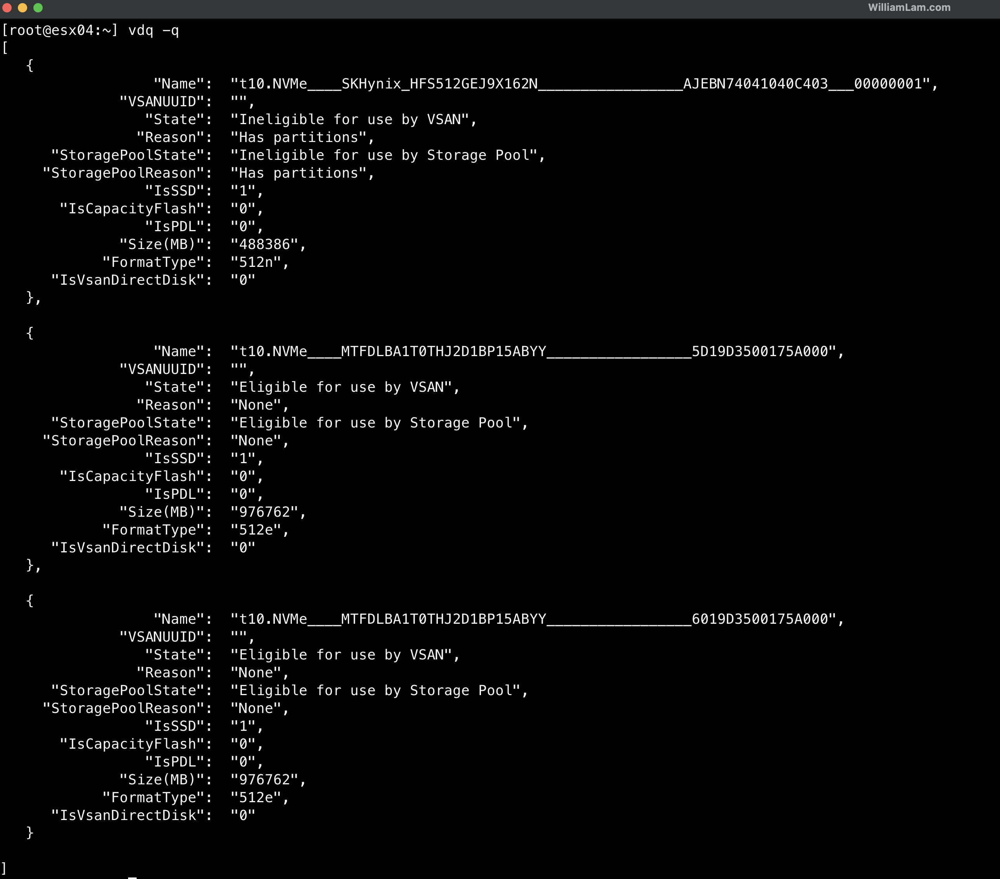

After creating the bootable ESX installer on your USB device, copy your modified ESX kickstart file(s) into the root directory of the USB device (kickstart file names must be uppercase).

Now, navigate into the USB device under `EFI/BOOT` and edit `BOOT.CFG` updating the `kernelopt` so it matches the following which will run our KS-ESX01.CFG instead of the interactive installation:

```code
bootstate=0
title=Loading ESXi installer
timeout=5
prefix=
kernel=/b.b00
kernelopt=ks=usb:/KS-ESX01.CFG
modules=jumpstrt.gz --- useropts.gz --- features.gz --- k.b00 --- uc_intel.b00 --- uc_amd.b00 --- uc_hygon.b00 --- vmx.v00 --- vim.v00 --- tpm.v00 --- sb.v00 --- s.v00 --- atlantic.v00 --- bcm_mpi3.v00 --- bnxtnet.v00 --- bnxtroce.v00 --- cndi_igc.v00 --- elxnet.v00 --- i40en.v00 --- iavmd.v00 --- icen.v00 --- igbn.v00 --- intelgpi.v00 --- ionic_cl.v00 --- ionic_en.v00 --- irdman.v00 --- iser.v00 --- ixgben.v00 --- lpfc.v00 --- lpnic.v00 --- lsi_mr3.v00 --- lsi_msgp.v00 --- lsi_msgp.v01 --- ne1000.v00 --- nenic_en.v00 --- nenic.v00 --- nfnic.v00 --- nhpsa.v00 --- nipmi.v00 --- nmlx5_cc.v00 --- nmlx5_co.v00 --- nmlx5_rd.v00 --- ntg3.v00 --- nvme_pci.v00 --- nvmerdma.v00 --- nvmetcp.v00 --- nvmxnet3.v00 --- nvmxnet3.v01 --- pvscsi.v00 --- qat.v00 --- qcnic.v00 --- qedentv.v00 --- qedrntv.v00 --- qfle3.v00 --- qfle3f.v00 --- qfle3i.v00 --- rdmahl.v00 --- rshim_ne.v00 --- rshim.v00 --- sfvmk.v00 --- smartpqi.v00 --- vmkata.v00 --- vmksdhci.v00 --- vmkusb.v00 --- vmw_ahci.v00 --- bmcal.v00 --- clusters.v00 --- crx.v00 --- drivervm.v00 --- btldr.v00 --- dvfilter.v00 --- esx_ui.v00 --- esxupdt.v00 --- tpmesxup.v00 --- weaselin.v00 --- xorg.v00 --- esxio_co.v00 --- infravis.v00 --- loadesx.v00 --- hpv2_hps.v00 --- intelv2_.v00 --- lsiv2_dr.v00 --- nvme_pci.v01 --- oem_dell.v00 --- oem_leno.v00 --- smartpqi.v01 --- native_m.v00 --- nsx_pyth.v01 --- podvm_ro.v00 --- qlnative.v00 --- trx.v00 --- vcls_pod.v00 --- vdfs.v00 --- vds_vsip.v00 --- vmware_e.v00 --- vmware_f.v00 --- hbrsrv.v00 --- vsan.v00 --- vsanheal.v00 --- vsanmgmt.v00 --- tools.t00 --- qp_esx_d.v00 --- nsx_adf.v00 --- nsx_cfga.v00 --- nsx_cont.v00 --- nsx_cpp_.v00 --- nsx_esx_.v00 --- nsx_expo.v00 --- nsx_head.v00 --- nsx_host.v00 --- nsx_moni.v00 --- nsx_mpa.v00 --- nsx_nest.v00 --- nsx_neto.v00 --- nsx_opsa.v00 --- nsx_plat.v00 --- nsx_prot.v00 --- nsx_prox.v00 --- nsx_pyth.v00 --- nsx_pyth.v02 --- nsx_scx.v00 --- nsx_sfhc.v00 --- nsx_shar.v00 --- nsx_snpr.v00 --- nsxcli.v00 --- vsipfwli.v00 --- gc.v00 --- imgdb.tgz --- basemisc.tgz --- resvibs.tgz --- esxiodpt.tgz --- imgpayld.tgz
build=9.1.1-0.25714478
updated=0
```

📒 If you are performing the installation on two or three physical ESX hosts, the only required change is to update the reference to kickstart file, so you know which file is being referenceed on the USB device.

5. Plug the USB device into your system and power on to begin the ESX installation.

6. Once ESX reboots (there is a secondary reboot as part of the ESX scripted installation), you should be able to log in to your ESX host using the FQDN and see something like the following:

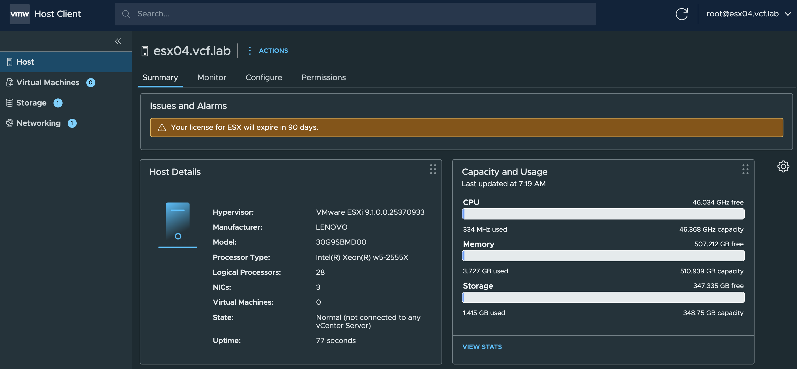

7. Deploy the VCF Installer appliance (VCF-SDDC-Manager-Appliance-9.1.1.0.25713928.ova) using the following shell script, [deploy_vcf_installer.sh](scripts/deploy_vcf_installer.sh), which relies on [OVFTool](https://developer.broadcom.com/tools/open-virtualization-format-ovf-tool/latest). Install OVFTool if you do not already have it on your local system.

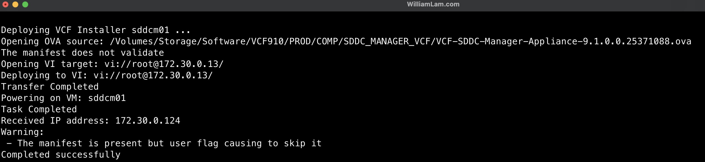

8. After the VCF Installer is up and running, we need to make a few configuration changes (credentials/networking). I have automated these changes, and you can run the following PowerShell script: [setup_vcf_installer.ps1](scripts/setup_vcf_installer.ps1).

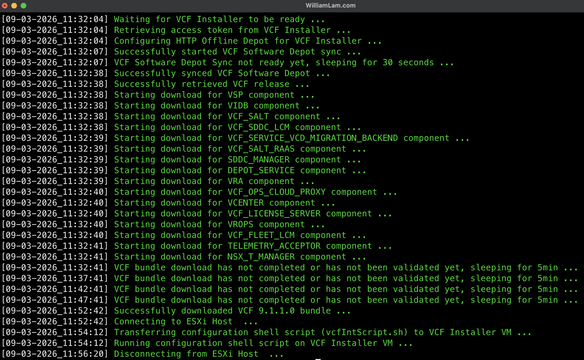

9. Before we can deploy our VCF 9.1 environment, we need to connect to the VCF Offline Depot that you set up in Step 1.

Open your browser to the VCF Installer (e.g. https://sddcm01.vcf.lab/), log in with the password you configured in Step 8, and then click the `DEPOT SETTINGS AND BINARY MANAGEMENT` button.

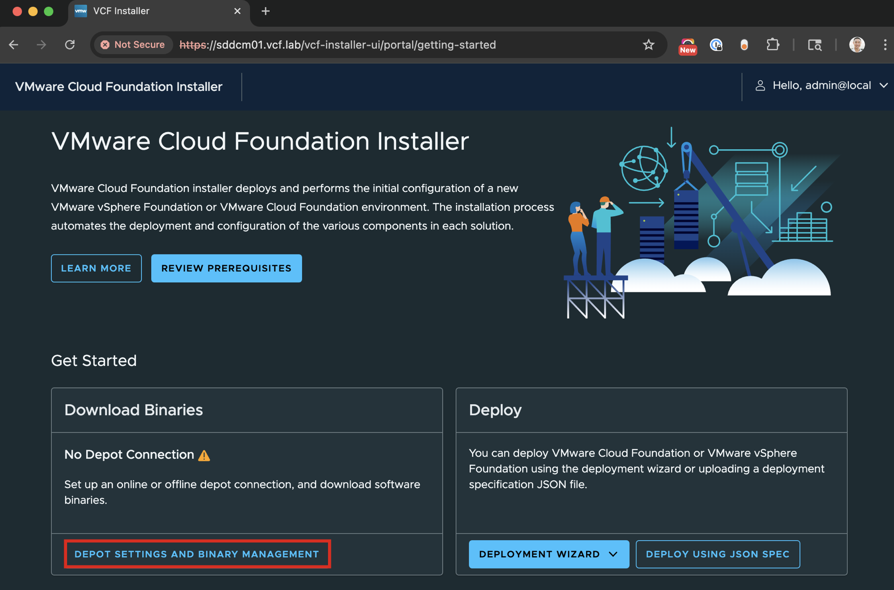

If Step 8 successfully connected to your VCF Offline Depot, it should already have synced the VCF metadata, which shows the list of binaries available for download. Click the `DOWNLOAD` button to begin downloading the required VCF binaries and ensure each item listed in the table has a `Success` status.

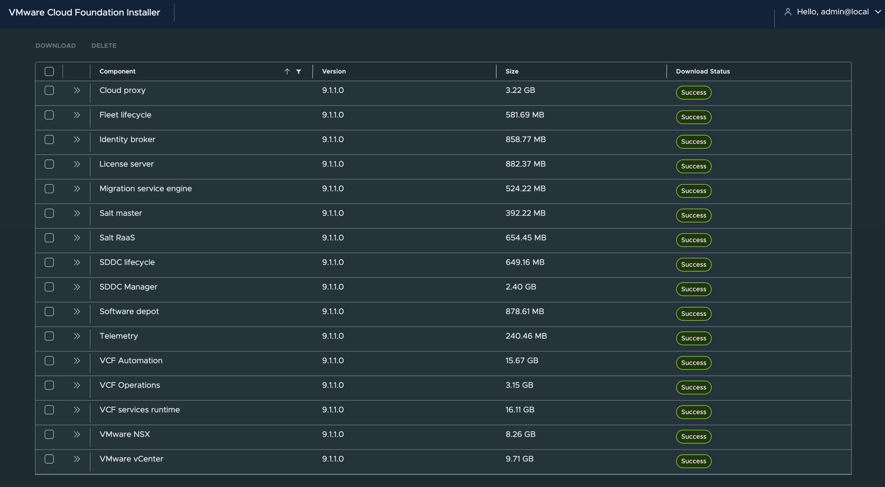

10. Navigate back to the VCF Installer homepage and click on `DEPLOY USING JSON SPEC` to begin your VCF deployment.

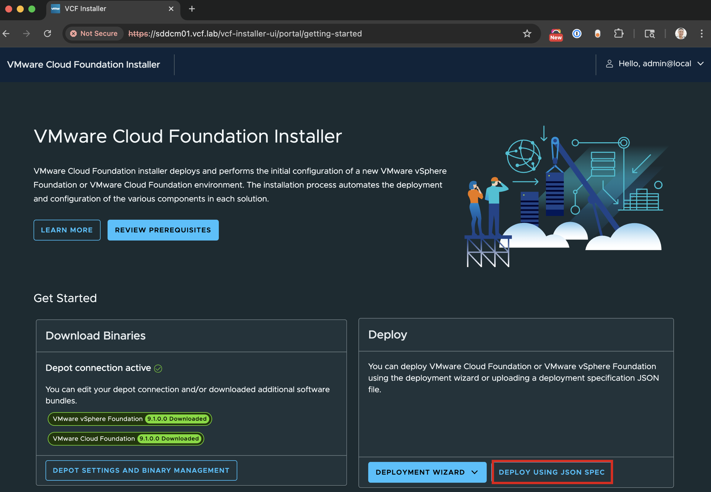

Upload your modified [VCF deployment JSON](config/) and click `Next` to begin the validation.
* One Host:
  * [VCF 9.1.1 One Host Deployment w/TEP JSON Sample](config/one-node-vsan-esa-tep.json)
  * [VCF 9.1.1 One Host Deployment w/TEP-less JSON Sample](config/one-node-vsan-esa-tepless.json)
* Two Host:
  * [VCF 9.1.1 Two Host Deployment w/TEP JSON Sample](config/two-node-vsan-esa-tep.json)
  * [VCF 9.1.1 Two Host Deployment w/TEP-less JSON Sample](config/two-node-vsan-esa-tepless.json)
* Three Host:
  * [VCF 9.1.1 Three Host Deployment w/TEP JSON Sample](config/three-node-vsan-esa-tep.json)
  * [VCF 9.1.1 Three Host Deployment w/TEP-less JSON Sample](config/three-node-vsan-esa-tepless.json)

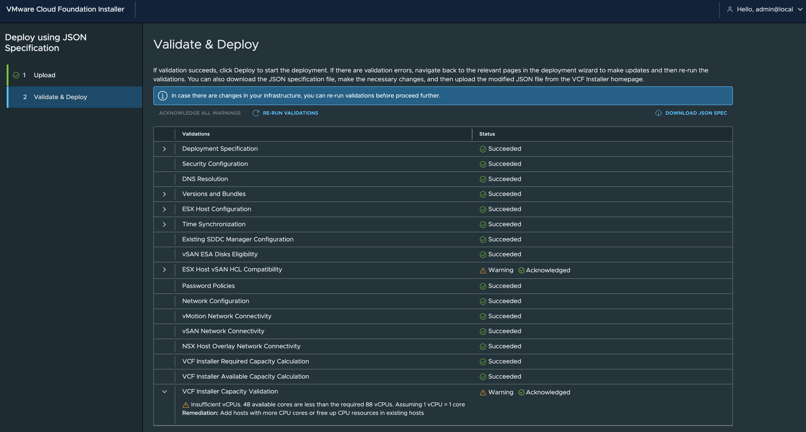

📒 You may encounter pre-checks that require acknowledgment to continue. I have noticed that with certain MikroTik devices, even when Jumbo Frames (MTU=9K) are configured, validation can fail while deployment still succeeds. In that case, simply acknowledge the configuration.

Once you have fixed and/or acknowledged all applicable pre-checks, click `DEPLOY` to start the deployment.

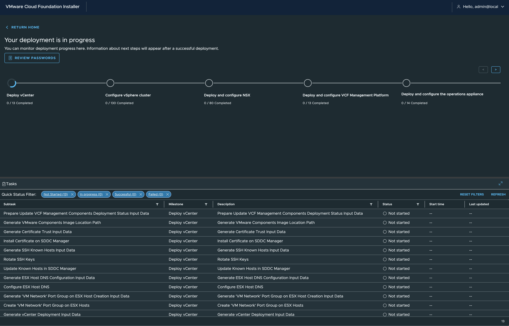

📒 During deployment, the VCF Installer generates its own self-signed TLS certificate, which forces a browser refresh and displays a message like the following. This is expected. Simply click the reload button as shown in the screenshot below.

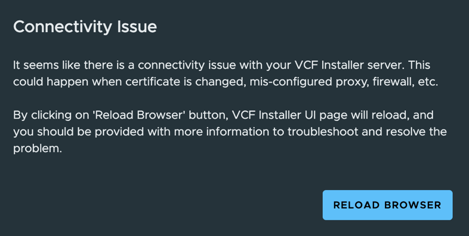

11. The deployment will take a few hours. Once everything has been deployed, you should see a success page like the following:

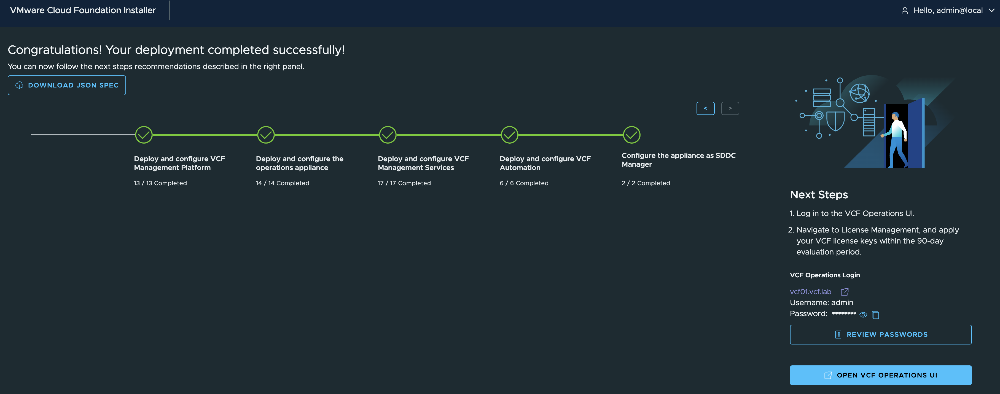

You can log in to your new VCF 9.1 deployment by clicking the link to VCF Operations and using the `admin` credentials you specified in your deployment JSON, or simply copying the credentials from this screen.

Here is an example of single host deployment and total deployment duration for each component:

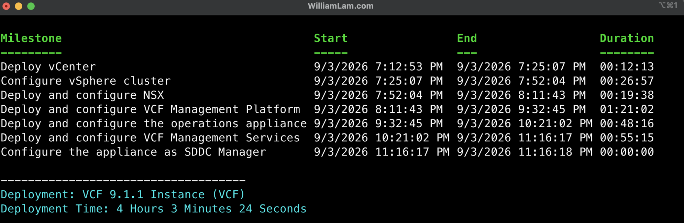

## Post Installation

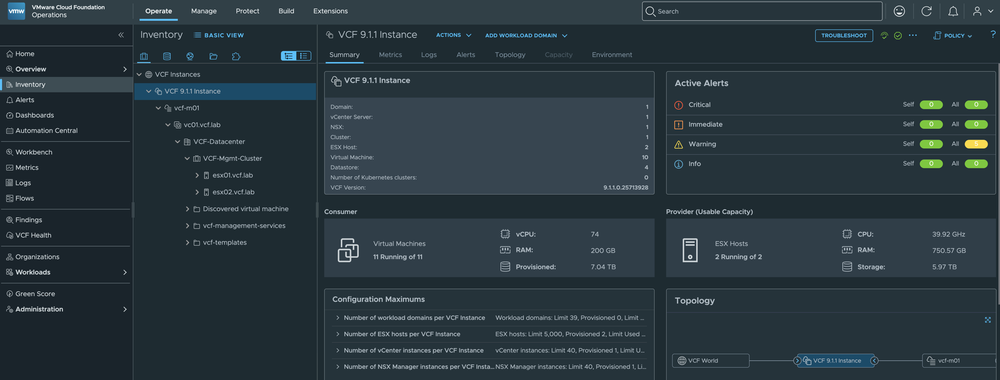

12. There are a number of [post-VCF deployment optimizations](https://williamlam.com/2026/04/automating-lab-optimizations-for-post-deployment-of-vmware-cloud-foundation-vcf.html) that should be run for lab environments. You can refer to the linked blog post and run the PowerShell script `vcf-post-deploy-lab-tweaks.ps1`.

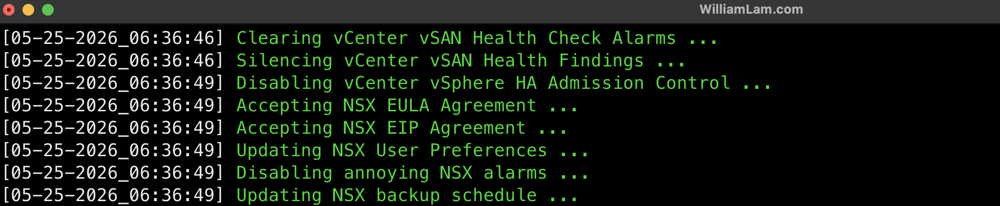

13. Additional optimization for those using AMD Zen4/5 CPUs.
* Apply [additional NSX optimization](https://williamlam.com/2026/07/quick-tip-reducing-high-cpu-utilization-on-nsx-due-to-slow-entropy-from-amd-zen4-5-cpus.html) for reducing High CPU Utilization on NSX components (NSX Manager, Edges and Virtual Network Appliances) when using AMD Zen4/5 CPUs.
* Apply [additional VCFA optimization](https://williamlam.com/2026/08/quick-tip-reducing-high-cpu-utilization-in-vcf-automation-vcfa-on-amd-zen4-zen5-cpus.html) for reducing High CPU Utilization on VCVF Automation (VCFA) when using AMD Zen4/5 CPUs.

## Additional Blog Resources

* [VMware Cloud Foundation (VCF) on Minisforum MS-A2](https://williamlam.com/2025/06/vmware-cloud-foundation-vcf-on-minisforum-ms-a2.html)
   * [VCF 9.x Hardware BOM for Silicon Valley VMUG](https://williamlam.com/2025/07/vcf-9-0-hardware-bom-for-silicon-valley-vmug.html)
   * [My VCF 9 Lab Mini-Rack](https://williamlam.com/2025/10/my-vcf-9-lab-mini-rack.html)
* [VCF 9.1 Resources](https://williamlam.com/vmware-cloud-foundation-9)